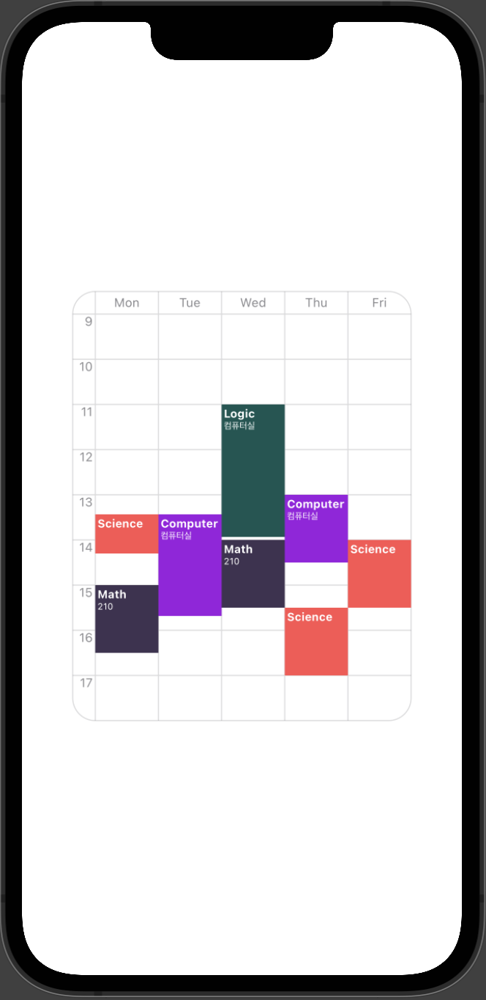

# JHTimeTable

SwiftUI Customizable School TimeTable Library



### Install
- Swift Package Manager 

### Usage

- Declare JHTimetable
    ```swift
    JHTimeTable(lineWidth: 0.5, lineColor: .secondary, cornerRadius: 15,
                items: $resources, background: {
                    Color.clear
                },onTapAction: { value in
                    // TapAction
                })
    ```

- Declare Class Item conform to ClassProtocol

    ```swift
    protocol ClassProtocol : Identifiable {
    
        associatedtype TimeItem : ClassTimeProtocol
    
        var name : String { get set }
    
        var room : String? { get set }
    
        var color : String { get set }
    
        var times : [TimeItem] { get set }
    }
    ```

- Declare class time structure conform to ClassTimeProtocol

    ```swift
    protocol ClassTimeProtocol : Identifiable {
    
        var weekday : ClassWeekType { get set }
    
        var start : Date { get set }
    
        var end : Date { get set }
    }
    ```

- Check example! (JHTimeTable/Example/ExampleModel.swift)

### Customize

- You can customize timetable by using modifier.

    |modifier|content|
    |-----|-----|
    |tableFrame|Set timetable frame|
    |tableTime|Set timetable max Time, min Time|
    |tableFont|Set timetable font|
    |tableColor|Set timetable week,time font color|
    |weekType|Set timetable week symbol type|
    |tableWeeks|Set timetable weeks|
